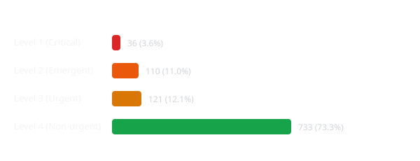

# Afya Triage Microservice

An Emergency Severity Index (ESI)-aligned clinical risk assessment microservice built for low-resource deployment environments.

---

## 📖 The Story Behind Afya Triage

**Afya** is the Swahili word for **"Health"**.

In rural clinics and under-resourced emergency departments across East Africa, healthcare workers face severe staffing shortages and overwhelming patient surges. Delayed recognition of critically ill individuals—particularly patients with silent hypoxia or unstable vital signs—frequently leads to preventable morbidity and mortality.

**Afya Triage** was built as a zero-dependency, deterministic clinical triage engine capable of running on low-cost edge devices and Android hardware via Termux. It prioritizes patients into 4 clinical urgency levels and enforces strict safety overrides for severe hypoxia (SpO2 < 88%), ensuring vital risk decisions occur in milliseconds even during power or internet grid failures.

---

## 📊 Analytics & Distribution Visualizations

---

## 🚀 Key Features
- **Deterministic Risk Engine**: Weighted clinical scoring based on vital signs with hard safety overrides for acute hypoxia (SpO2 < 88%).
- **Dual API Specs**: Supports both single-patient real-time assessment and array-based batch processing.
- **Production-Ready Stack**: Powered by Flask WSGI behind Gunicorn with multi-worker concurrency.
- **Automated Streak Tracker**: Daily GitHub Actions heartbeat workflow (`.github/workflows/daily-streak.yml`) to keep repository metrics active.

---

## 📦 Project Structure

afya-triage/
├── .github/workflows/
│   ├── ci.yml                 # GitHub Actions CI pipeline
│   └── daily-streak.yml       # Automated daily commit streak workflow
├── data/                      # Synthetic patient data store
├── docs/                      # Generated SVG visualizations
├── models/                    # Model evaluation metadata
├── src/
│   ├── api.py                 # Flask REST endpoints
│   ├── dataset.py             # Synthetic vital signs generator
│   ├── triage.py              # ESI clinical classification engine
│   └── visualize.py           # SVG visualization generator
├── tests/
│   └── test_triage.py         # Pytest test suite
├── Dockerfile                 # Container configuration
├── requirements.txt           # Python dependencies
└── start_server.sh            # Gunicorn WSGI startup script

---

## 🛠 Local Setup & Testing

1. Install dependencies:
   pip install -r requirements.txt

2. Run test suite:
   PYTHONPATH=. pytest -v

3. Generate visualizations:
   PYTHONPATH=. python3 src/visualize.py

4. Start production server:
   ./start_server.sh

---

## 📡 API Endpoint Reference

### Single Patient Assessment (POST /triage)
curl -X POST http://127.0.0.1:8000/triage \
  -H "Content-Type: application/json" \
  -d '{
    "systolic_bp": 120,
    "diastolic_bp": 80,
    "heart_rate": 75,
    "respiratory_rate": 16,
    "oxygen_saturation": 85,
    "temperature": 36.6
  }'

### Batch Patient Processing (POST /triage/batch)
curl -X POST http://127.0.0.1:8000/triage/batch \
  -H "Content-Type: application/json" \
  -d '[
    {"systolic_bp": 120, "diastolic_bp": 80, "heart_rate": 75, "respiratory_rate": 16, "oxygen_saturation": 98, "temperature": 36.6},
    {"systolic_bp": 118, "diastolic_bp": 76, "heart_rate": 70, "respiratory_rate": 14, "oxygen_saturation": 84, "temperature": 36.5}
  ]'

---

## 🐳 Container Deployment
docker build -t afya-triage:latest .
docker run -d -p 8000:8000 --name afya-triage-service afya-triage:latest
